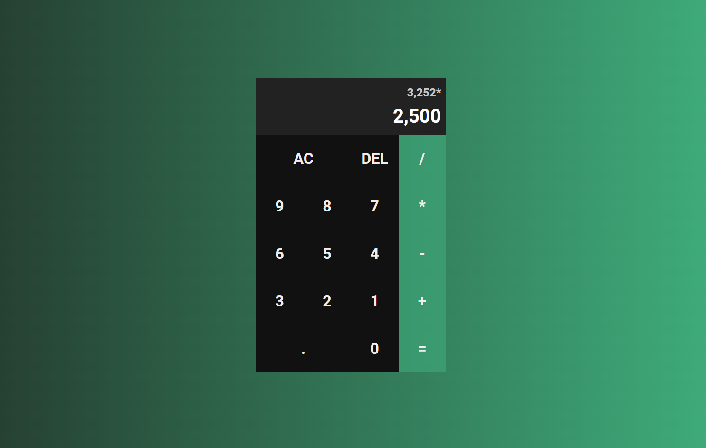

Esse projeto foi desenvolvido seguindo o vídeo tutorial do Felipe Rocha, vídeo em que ele ensina a criar uma calculadora usando HTML, CSS e Javascript.
 
Meu interesse no projeto se deu em fixar conceitos já estudados de HTML, CSS e Javascript em um projeto de fato.

<h2>Canal do youtube da Felipe Rocha - dicasparadevs:</h2> https://www.youtube.com/@dicasparadevs

<h2>Print do resultado do projeto</h2>

Esse projeto é de uma calculadora onde é possível fazer cálculos com operadores básicos.